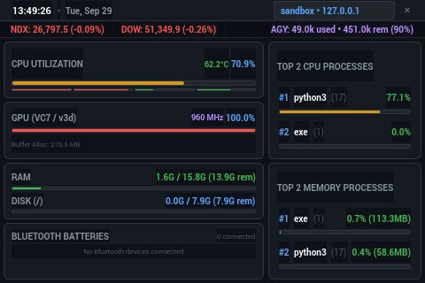

# 3.5" SPI-1 Display System Monitor

<p align="center">
  
</p>

A lightweight, hardware-accelerated, dark-themed system monitor tailored specifically for a **3.5-inch display** (480x320 resolution) on the **Raspberry Pi 5** running under the **`labwc` Wayland compositor** on output **`SPI-1`**.

---

## Key Features

- **Optimized for 3.5" (480x320)**: Pixel-perfect compact layout designed to eliminate scrollbars and make all system metrics readable at a glance from TFT viewing angles.
- **SPI-1 Display Auto-Placement**: Programmatically locates the `SPI-1` output at coordinates `(0, 0)` and includes automated `labwc` window rules so it always launches cleanly on your 3.5" screen without window titlebars wasting space.
- **Live CPU & SoC Temperature**: Overall CPU utilization %, per-core 4-core mini meter bars, dynamic green/amber/red color transitions, and SoC thermal temperature (°C).
- **RAM & Root Disk Storage in GB**: Real-time display of system memory used, available, and total in GB (e.g. `1.6G / 15.8G (13.9G rem)`) plus root partition (`/`) disk space used and free in GB with dedicated progress meters.
- **Broadcom VideoCore VII (v3d) GPU Tracking**: Real-time DRM engine utilization %, dynamic GPU clock frequency (up to 960 MHz), and allocated buffer memory (`bo_stats`).
- **Connected Bluetooth Device Batteries**: Live battery percentage badges and status bars for connected peripherals (headphones, mice, keyboards, controllers) via BlueZ D-Bus and UPower.
- **Top 2 CPU & Top 2 Memory Processes**: High-legibility process cards showcasing the top two consumers of processing and memory with process name, PID, and percentage badges.
- **Hostname & LAN IP Address**: Machine hostname and primary LAN IPv4 address displayed directly in the header bar.
- **Live Time & Date**: Digital clock with seconds (`HH:MM:SS`) and formatted date (`Day, Month Date`).
- **Market Tickers (NASDAQ & DOW)**: Live quotes for NASDAQ (`NDX`) and Dow Jones (`DOW`) with point change and percentage change color coding (+ green / - red), backed by an offline cache.
- **Antigravity Token & Quota Tracker**: Automatically analyzes Antigravity conversation transcripts to compute active session tokens, rolling 5-hour quota consumption, and remaining tokens for your Google AI plan.
- **Desktop & Taskbar Launcher**: Double-clickable shortcut placed right on your Desktop (`~/Desktop/spi1-system-monitor.desktop`), custom icon in your application menu, and taskbar integration.

---

## Visual Layout Overview

```
+-----------------------------------------------------------------------------------+
| 13:49:26 • Tue, Sep 29                       [ sandbox • 192.168.1.142 ]      [✕] |  <- Header (24px)
+-----------------------------------------------------------------------------------+
| NDX: 26,797.5 (-0.09%) • DOW: 51,349.9 (-0.26%) • AGY: 49.0k used • 451.0k rem(90%)| <- Ticker (19px)
+----------------------------------------+------------------------------------------+
| CPU UTILIZATION          62.2°C  70.9% | TOP 2 CPU PROCESSES                      |
| [====================--------]         | #1 python3 (17)                    77.1% |
| [-] [-] [-] [-] (4-core mini bars)     | [==============================----------|
+----------------------------------------+ #2 exe (1)                          0.0% |
| GPU (VC7 / v3d)       960 MHz   100.0% | [----------------------------------------|
| [==============================]        +------------------------------------------+
| Buffer Alloc: 270.3 MB                 | TOP 2 MEMORY PROCESSES                   |
+----------------------------------------+ #1 exe (1)               0.7% (113.3 MB) |
| RAM             1.6G / 15.8G (13.9G rem) [=---------------------------------------|
| [==----------------------------------] | #2 python3 (17)           0.4% (58.6 MB) |
| DISK (/)         0.0G / 7.9G (7.9G rem)| [----------------------------------------|
| [------------------------------------] +------------------------------------------+
+----------------------------------------+
| BLUETOOTH BATTERIES        0 connected |
|       No Bluetooth devices connected   |
+----------------------------------------+
```

---

## Directory Structure

```
spi1-system-monitor/
├── main.py                  # Main Python application entry point
├── run.sh                   # Environment launcher script
├── install_rules.py         # Configures labwc rc.xml window rules & autostart
├── config.json              # Customization options (intervals, display, plan budget)
├── README.md                # Documentation with application preview
├── docs/
│   ├── preview.png          # Screenshot of the 480x320 UI
│   └── icon.png             # Application icon
├── resources/
│   └── icon.png             # 128x128 high-resolution window and taskbar icon
├── monitor/
│   ├── __init__.py
│   ├── cpu.py               # CPU utilization, cores, and SoC temperature
│   ├── gpu.py               # VideoCore VII (v3d) DRM engine & clock speed
│   ├── system_info.py       # RAM, Disk, Hostname, and LAN IP address
│   ├── bluetooth.py         # BlueZ D-Bus / UPower Bluetooth battery monitor
│   ├── market.py            # NASDAQ and Dow Jones market quotes with cache
│   ├── antigravity_tokens.py# Antigravity token usage and plan quota
│   ├── processes.py         # Top 2 CPU and Memory processes
│   └── worker.py            # Multi-interval background QThread worker
└── ui/
    ├── __init__.py
    ├── window.py            # 480x320 Main window with screen positioning
    ├── dashboard_view.py    # All-in-One dashboard layout
    ├── components.py        # Meters, process rows, battery rows, ticker ribbon
    └── styles.py            # High-contrast dark theme CSS
```

---

## Quick Start

### 1. Run the Terminal Test
Verify all metric collectors (CPU, GPU, Bluetooth, Storage, Network, Processes, Market, Tokens) without opening a GUI:
```bash
python3 main.py --test
```

### 2. Launch the Application
Run via the launcher script:
```bash
./run.sh
```

Or run directly with Python:
```bash
python3 main.py
```

### 3. Command-Line Options
- `--windowed`, `-w`: Run with standard window borders and decorations (useful when testing on your HDMI screen).
- `--fullscreen`, `-f`: Run in true fullscreen mode.
- `--output <NAME>`, `-o <NAME>`: Target a different display output (e.g. `HDMI-A-1`).
- `--config <PATH>`, `-c <PATH>`: Use a custom configuration file.

---

## Setup & Desktop Integration

### 1. Lock Window to SPI-1 Desktop via `labwc`
To ensure `labwc` automatically anchors the window to `SPI-1` without window decorations (saving 30+ pixels of vertical space):

```bash
python3 install_rules.py
```
This safely creates a backup (`~/.config/labwc/rc.xml.bak`), injects the `<windowRule>` for `spi1-system-monitor`, installs the desktop shortcut (`~/Desktop/spi1-system-monitor.desktop`), and installs icons into `~/.local/share/icons/` and `~/.local/share/pixmaps/`.

### 2. Enable Autostart on Boot / Desktop Login
To automatically launch the monitor whenever your desktop session starts:
```bash
python3 install_rules.py --autostart
```
To disable autostart:
```bash
python3 install_rules.py --no-autostart
```

---

## Configuration (`config.json`)

You can edit `config.json` to customize intervals and defaults:
- `refresh_intervals`:
  - `system_seconds`: How often CPU, GPU, RAM, Disk, and Top 2 processes update (default: `1.5`s).
  - `market_seconds`: Market ticker refresh interval (default: `60`s).
  - `tokens_seconds`: Antigravity token usage scan interval (default: `10`s).
  - `bluetooth_seconds`: Bluetooth peripheral check interval (default: `5`s).
- `antigravity`:
  - `plan_token_budget`: Token ceiling for calculating remaining tokens (default: `500000`).
  - `rolling_window_hours`: Rolling quota evaluation window (default: `5` hours).
- `market`:
  - `symbols`: Symbols to monitor (default: `^IXIC` for NASDAQ, `^DJI` for DOW).

---

## License

MIT License.
